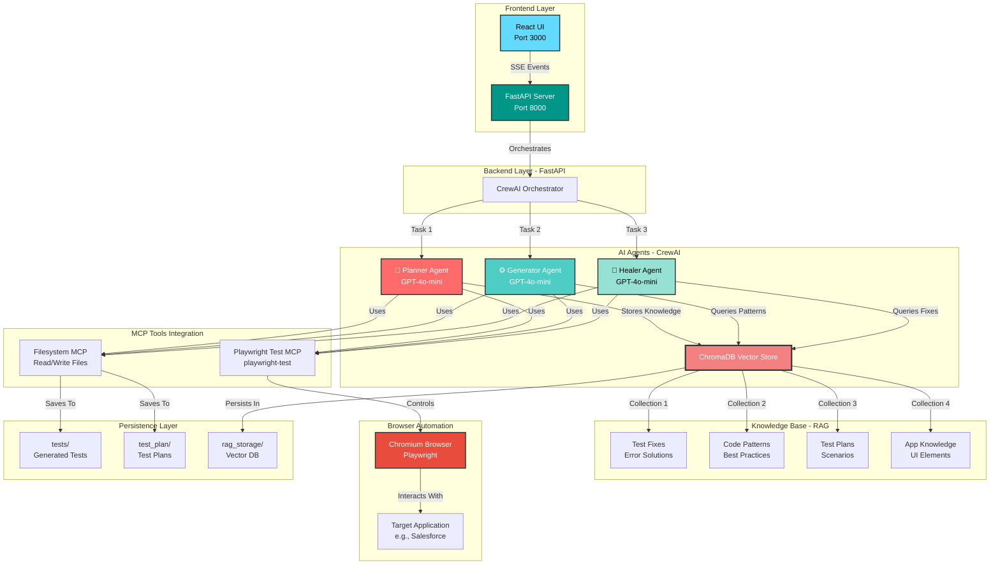
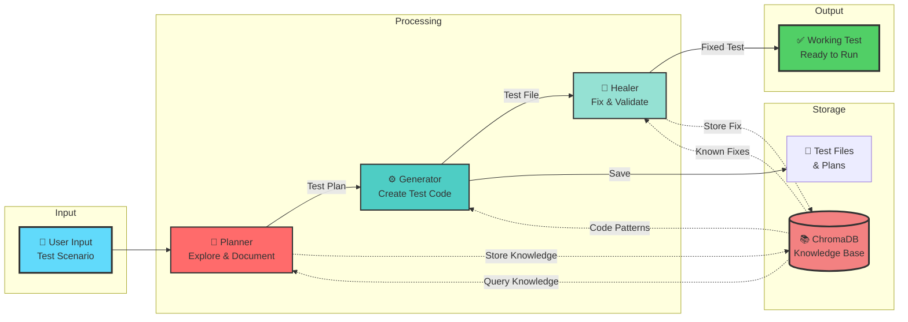

# 🏗️ Playwright AI Test Automation - Architecture

## 🎯 System Overview

This project uses AI agents powered by CrewAI to automatically explore web applications, generate Playwright tests, and heal failing tests using RAG (Retrieval-Augmented Generation).

---

## 📊 Architecture Diagram



---

## 🔄 Agent Workflow



**Flow:**
1. **Planner** explores app → creates test plan → stores UI knowledge in RAG
2. **Generator** receives plan → executes steps in browser → generates test file
3. **Healer** runs test → fixes errors using RAG → validates working test

---

## Tech Stack Layers

```mermaid
graph TB
    subgraph "Layer 1: Presentation"
        L1A[React UI]
        L1B[TypeScript]
        L1C[CSS]
    end

    subgraph "Layer 2: API"
        L2A[FastAPI]
        L2B[SSE Streaming]
        L2C[REST Endpoints]
    end

    subgraph "Layer 3: Orchestration"
        L3A[CrewAI Framework]
        L3B[Multi-Agent System]
        L3C[Task Management]
    end

    subgraph "Layer 4: Intelligence"
        L4A[OpenAI GPT-4o-mini]
        L4B[CrewAI Framework]
        L4C[Prompt Engineering]
    end

    subgraph "Layer 5: Knowledge"
        L5A[ChromaDB Vectors]
        L5B[RAG Retrieval]
        L5C[Semantic Search]
    end

    subgraph "Layer 6: Automation"
        L6A[Playwright]
        L6B[MCP Protocol]
        L6C[Browser Control]
    end

    subgraph "Layer 7: Storage"
        L7A[Filesystem]
        L7B[Vector DB]
        L7C[JSON State]
    end

    L1A --> L2A
    L1B --> L2B
    L1C --> L2C
    
    L2A --> L3A
    L2B --> L3B
    L2C --> L3C
    
    L3A --> L4A
    L3B --> L4B
    L3C --> L4C
    
    L4A --> L5A
    L4B --> L5B
    L4C --> L5C
    
    L5A --> L6A
    L5B --> L6B
    L5C --> L6C
    
    L6A --> L7A
    L6B --> L7B
    L6C --> L7C

    style L1A fill:#61dafb
    style L2A fill:#009688
    style L3A fill:#673ab7
    style L4A fill:#ff9800
    style L5A fill:#f38181
    style L6A fill:#e74c3c
    style L7A fill:#34495e
```



---

## 🛠️ Technology Stack

### **Frontend**
- **React** (TypeScript) - UI framework
- **Axios** - API communication
- **Server-Sent Events (SSE)** - Real-time updates

### **Backend**
- **FastAPI** - Python web framework
- **Uvicorn** - ASGI server
- **Pydantic** - Data validation

### **AI/ML Layer**
- **CrewAI** - Multi-agent orchestration framework
- **OpenAI GPT-4o-mini** - Language model

### **Knowledge Base**
- **ChromaDB** - Vector database for RAG
- **Embeddings** - Semantic search capabilities

### **Browser Automation**
- **Playwright** - Browser automation
- **MCP (Model Context Protocol)** - Tool integration
  - `playwright-test` server
  - `filesystem` server

### **Storage**
- **Local filesystem** - Test files, plans
- **ChromaDB** - Vector embeddings
- **JSON** - Session state, auth

---

## 📦 Key Components

### 1. **Planner Agent** 🧠
**Role:** Application explorer and test planner
- Checks RAG for existing knowledge (avoids redundant exploration)
- Launches browser to explore web applications
- Documents UI elements, navigation paths, and user flows
- Stores discoveries in RAG for future reuse
- Generates comprehensive test plans

### 2. **Generator Agent** ⚙️
**Role:** Test script creator
- Receives test plan from Planner (or file)
- Queries RAG for code patterns and best practices
- Executes manual test steps in browser
- Records Playwright code from actions
- Generates TypeScript test files

### 3. **Healer Agent** 🔧
**Role:** Test debugger and fixer
- Runs failing tests to identify issues
- Searches RAG for proven fixes
- Applies fixes systematically (max 2 attempts)
- Stores successful fixes in RAG
- Marks unfixable tests as `test.fixme()`

### 4. **RAG System** 🧠
**Collections:**
- **test_fixes** - Error patterns → solutions
- **code_patterns** - Playwright best practices
- **test_plans** - Scenario documentation
- **application_knowledge** - UI elements & navigation

---

## 🚀 Workflow Modes

### **Full Workflow** 
Planner → Generator → Healer (end-to-end automation)

### **Individual Agents**
- **Planner Only:** Explore & document
- **Generator Only:** Create tests from existing plan
- **Healer Only:** Fix specific failing tests

---

## 🎯 Key Features

✅ **Smart Caching** - RAG prevents redundant exploration  
✅ **Context Chaining** - Agents pass outputs seamlessly  
✅ **Self-Healing Tests** - Automatic fix application  
✅ **Real-time Updates** - SSE streaming to UI  
✅ **MCP Integration** - Modular tool system  
✅ **Vector Search** - Semantic similarity matching  

---

## 📁 Project Structure

```
playwright_agents/
├── ui/                          # React frontend
│   └── src/
│       └── App.tsx             # Main UI component
├── api/
│   └── server.py               # FastAPI backend
├── src/test_ai_assistant/
│   ├── crew.py                 # CrewAI agent definitions
│   ├── config/
│   │   ├── agents.yaml         # Agent configurations
│   │   └── tasks.yaml          # Task definitions
│   ├── rag/
│   │   ├── vector_store.py     # ChromaDB interface
│   │   └── retriever.py        # RAG query logic
│   └── tools/
│       ├── playwright_test_mcp.py  # Playwright MCP adapter
│       └── filesystem_mcp.py       # File MCP adapter
├── tests/                      # Generated test files
├── test_plan/                  # Generated test plans
├── rag_storage/                # Vector database
└── playwright.config.ts        # Playwright configuration
```

---

## 🔗 Integration Points

1. **Frontend ↔ Backend:** REST API + SSE
2. **Backend ↔ CrewAI:** Python SDK
3. **Agents ↔ RAG:** ChromaDB queries
4. **Agents ↔ Browser:** MCP Playwright tools
5. **Agents ↔ Filesystem:** MCP filesystem tools

---

## 📈 Scalability Considerations

- **Agent Parallelization:** Currently sequential, can be parallelized
- **RAG Expansion:** Add more collections for domain knowledge
- **Multi-Model Support:** Configurable LLM providers (OpenAI, Gemini, Groq)
- **Distributed RAG:** ChromaDB can scale to cloud deployment

---

*Built with ❤️ using AI-powered test automation*
