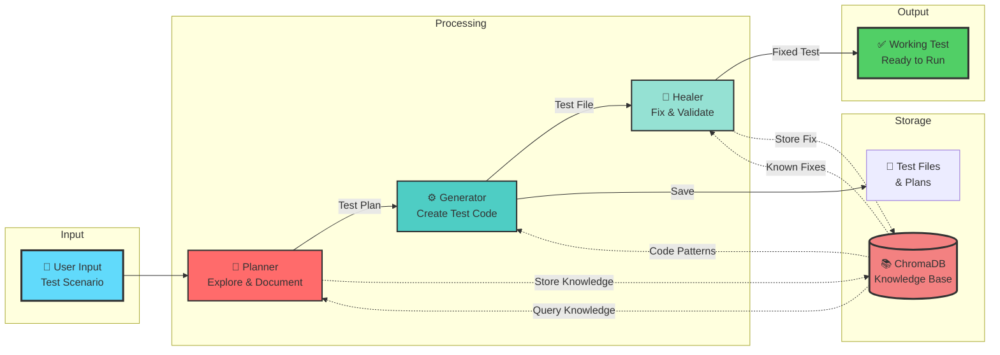

# 🎨 Visual Tech Stack

## Data Flow Diagram



---

## Tech Stack Layers


---

## 📸 How to Use

### View in GitHub
GitHub automatically renders Mermaid diagrams when you view this file in your repository.

### Export as Image
1. **Using Mermaid Live Editor:**
   - Go to https://mermaid.live
   - Copy any diagram code above
   - Click "Export" → PNG/SVG
   - Use for presentations or LinkedIn posts

2. **Using VS Code:**
   - Install "Markdown Preview Mermaid Support" extension
   - Open this file and preview (Cmd+Shift+V)
   - Right-click diagram → Copy as image

### For LinkedIn Posts

**Example Post:**
```
🚀 Built an AI-powered Test Automation Platform with multi-agent orchestration!

🏗️ Tech Stack:
• React + TypeScript (Frontend)
• FastAPI + Python (Backend)  
• CrewAI + GPT-4o-mini (AI Agents)
• ChromaDB (Vector RAG)
• Playwright (Browser Automation)
• MCP Protocol (Tool Integration)

💡 How it works:
1️⃣ Planner Agent explores your app
2️⃣ Generator Agent creates test code
3️⃣ Healer Agent fixes failing tests automatically

✅ Self-healing tests
✅ RAG prevents redundant work
✅ Real-time workflow updates

[Include diagram image]

#AI #TestAutomation #Python #React #CrewAI #Playwright
```

---

*Ready to showcase! 🚀*
