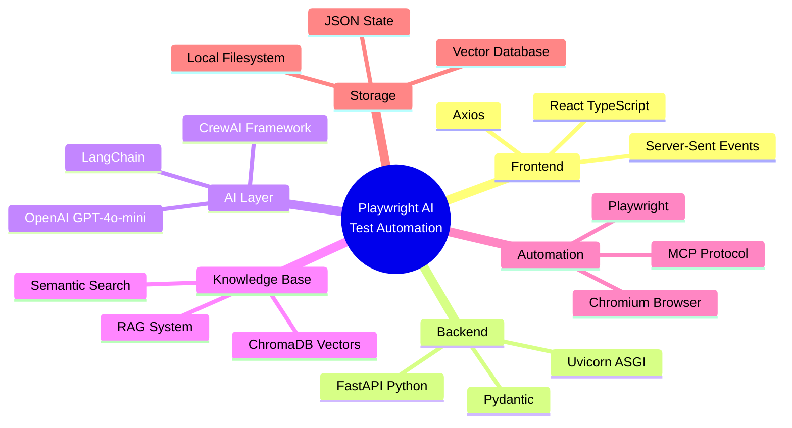
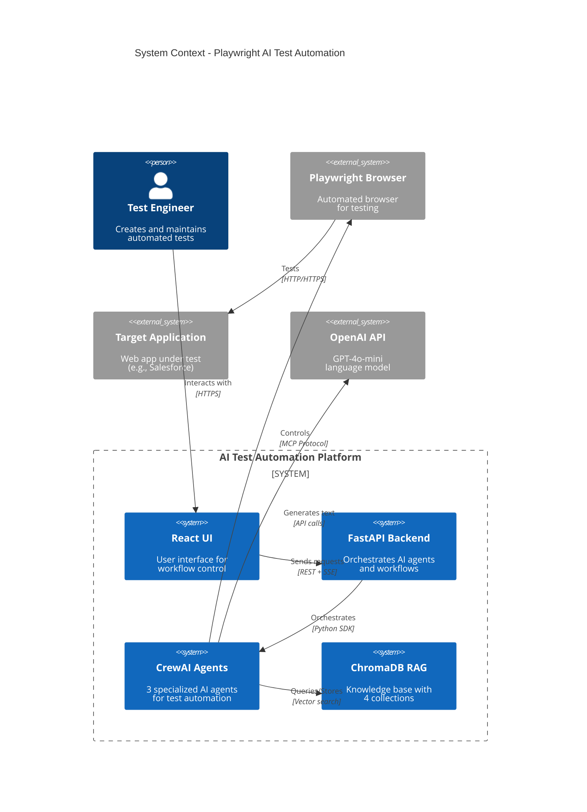
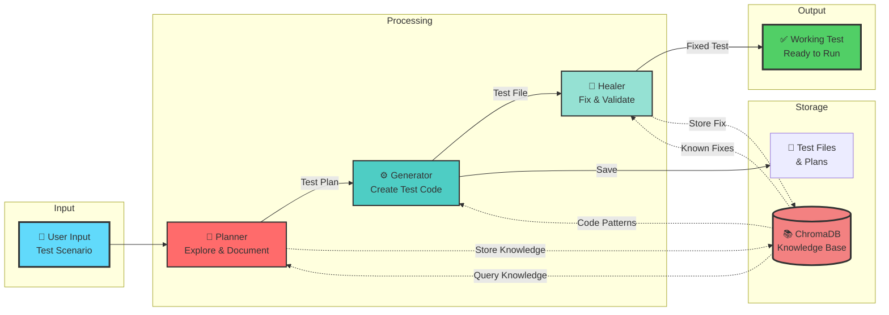

# 🎨 Visual Tech Stack - For LinkedIn & Presentations

## Quick Tech Stack Overview



---

## Component Architecture (Detailed)



---

## Data Flow Diagram



---

## Tech Stack Layers

```mermaid
graph TB
    subgraph "Layer 1: Presentation"
        L1A[React UI]
        L1B[TypeScript]
        L1C[CSS]
    end

    subgraph "Layer 2: API"
        L2A[FastAPI]
        L2B[SSE Streaming]
        L2C[REST Endpoints]
    end

    subgraph "Layer 3: Orchestration"
        L3A[CrewAI Framework]
        L3B[Multi-Agent System]
        L3C[Task Management]
    end

    subgraph "Layer 4: Intelligence"
        L4A[OpenAI GPT-4o-mini]
        L4B[LangChain Tools]
        L4C[Prompt Engineering]
    end

    subgraph "Layer 5: Knowledge"
        L5A[ChromaDB Vectors]
        L5B[RAG Retrieval]
        L5C[Semantic Search]
    end

    subgraph "Layer 6: Automation"
        L6A[Playwright]
        L6B[MCP Protocol]
        L6C[Browser Control]
    end

    subgraph "Layer 7: Storage"
        L7A[Filesystem]
        L7B[Vector DB]
        L7C[JSON State]
    end

    L1A --> L2A
    L1B --> L2B
    L1C --> L2C
    
    L2A --> L3A
    L2B --> L3B
    L2C --> L3C
    
    L3A --> L4A
    L3B --> L4B
    L3C --> L4C
    
    L4A --> L5A
    L4B --> L5B
    L4C --> L5C
    
    L5A --> L6A
    L5B --> L6B
    L5C --> L6C
    
    L6A --> L7A
    L6B --> L7B
    L6C --> L7C

    style L1A fill:#61dafb
    style L2A fill:#009688
    style L3A fill:#673ab7
    style L4A fill:#ff9800
    style L5A fill:#f38181
    style L6A fill:#e74c3c
    style L7A fill:#34495e
```



---

## 📸 How to Use for LinkedIn

### Option 1: Static Image (Easiest)
1. Open this file in VS Code
2. Install "Markdown Preview Mermaid Support" extension
3. Right-click on any diagram → "Copy as PNG"
4. Post directly to LinkedIn

### Option 2: GitHub README (Best for Portfolio)
1. Copy any diagram to your main README.md
2. GitHub automatically renders Mermaid diagrams
3. Share the GitHub link on LinkedIn

### Option 3: Live Interactive (Most Impressive)
1. Go to https://mermaid.live
2. Copy diagram code
3. Export as SVG/PNG with custom styling
4. Or share the live link

### Option 4: Create Infographic
Use tools like:
- **Canva** - Import diagram as image + add text
- **Figma** - Professional design polish
- **Excalidraw** - Hand-drawn style recreation

---

## 🎯 LinkedIn Post Suggestions

### Post 1: Architecture Overview
```
🚀 Built an AI-powered Test Automation Platform using multi-agent systems!

🏗️ Tech Stack:
• React + TypeScript (Frontend)
• FastAPI + Python (Backend)
• CrewAI + GPT-4 (AI Orchestration)
• ChromaDB (Vector RAG)
• Playwright (Browser Automation)

💡 What makes it unique:
✅ 3 specialized AI agents work together
✅ RAG system prevents redundant work
✅ Self-healing tests that fix themselves
✅ Real-time workflow updates

[Include Architecture Diagram]

#AI #TestAutomation #Python #React #CrewAI
```

### Post 2: Workflow Focus
```
⚡ How AI agents collaborate to create perfect tests:

1️⃣ Planner Agent 🧠
   Explores your app and maps the UI

2️⃣ Generator Agent ⚙️
   Creates Playwright test code

3️⃣ Healer Agent 🔧
   Fixes failing tests automatically

📚 Powered by RAG (Retrieval-Augmented Generation)
   Learns from every test run!

[Include Workflow Sequence Diagram]

#MachineLearning #QA #Automation
```

### Post 3: Tech Deep Dive
```
🔧 Building with MCP (Model Context Protocol)

My AI agents use MCP to:
🌐 Control browsers (Playwright)
📁 Read/write test files
🧠 Query vector databases
💾 Store learned patterns

This modular approach makes the system:
✅ Extensible (add new tools easily)
✅ Reliable (isolated components)
✅ Scalable (parallel execution ready)

[Include Component Diagram]

#SoftwareArchitecture #AIEngineering
```

---

## 🎬 Demo Video Script

If you want to create a demo video:

1. **Intro (10s):** "AI-powered test automation with 3 intelligent agents"
2. **Show UI (15s):** React interface, select workflow
3. **Planner in action (20s):** Browser opening, exploring Salesforce
4. **Generator in action (20s):** Creating test file in real-time
5. **Healer in action (20s):** Running test, detecting error, fixing it
6. **Show results (15s):** Working test file, RAG knowledge stored
7. **Architecture overview (20s):** Quick tour through the diagram

Total: ~2 minute video

---

*Ready to showcase! 🚀*
